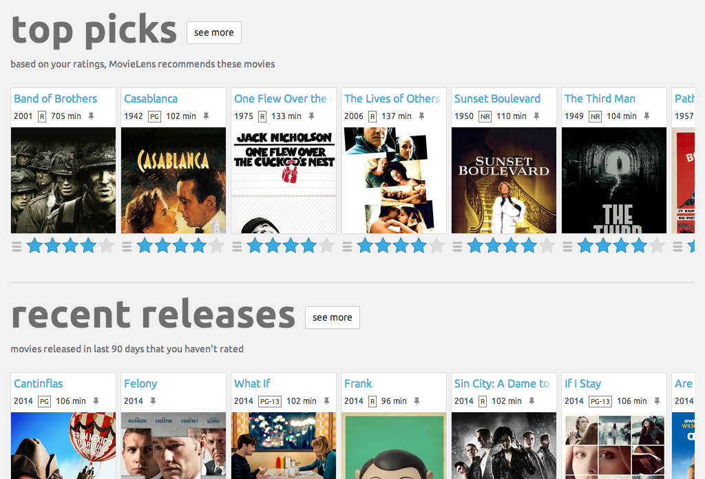
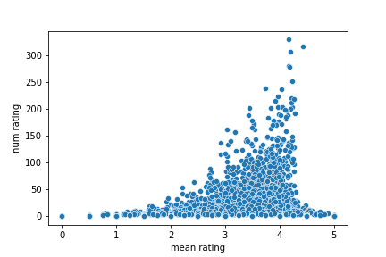
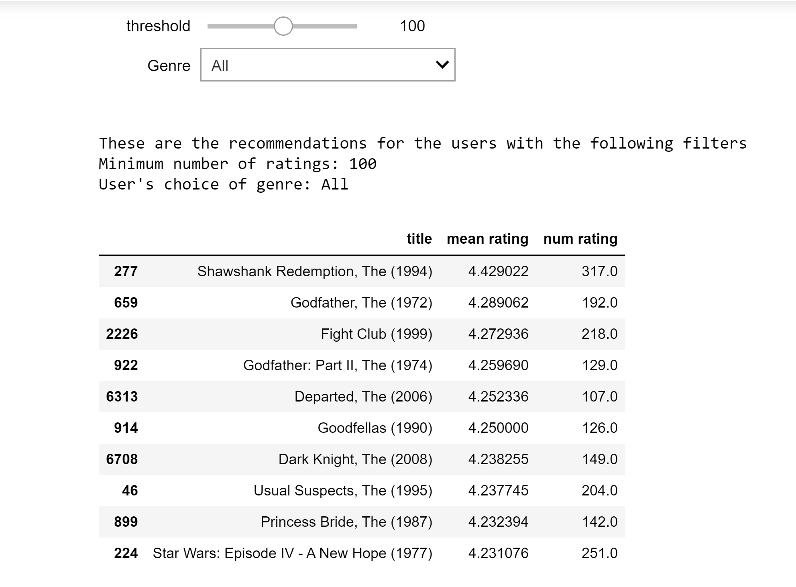
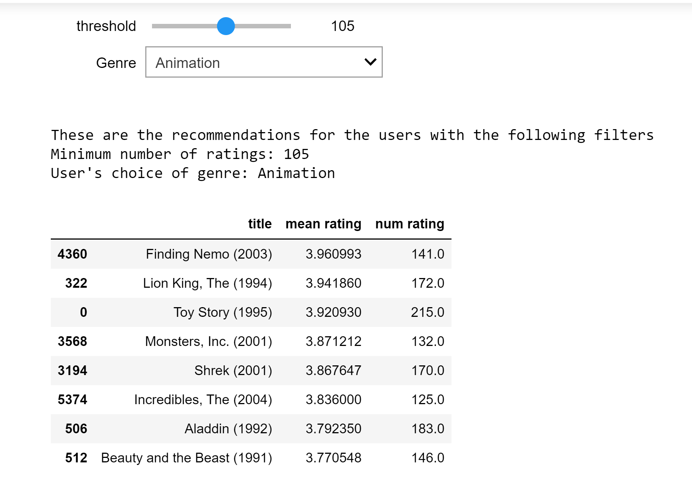
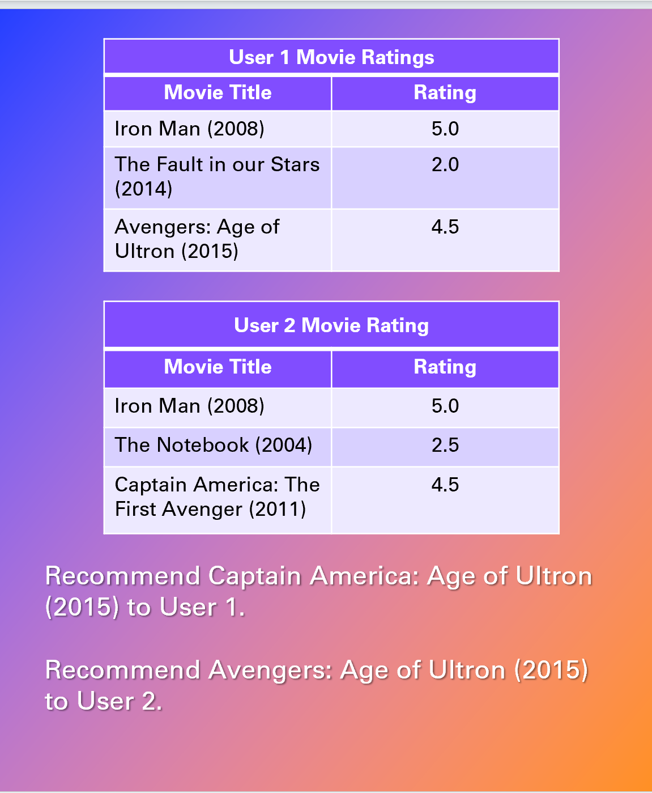
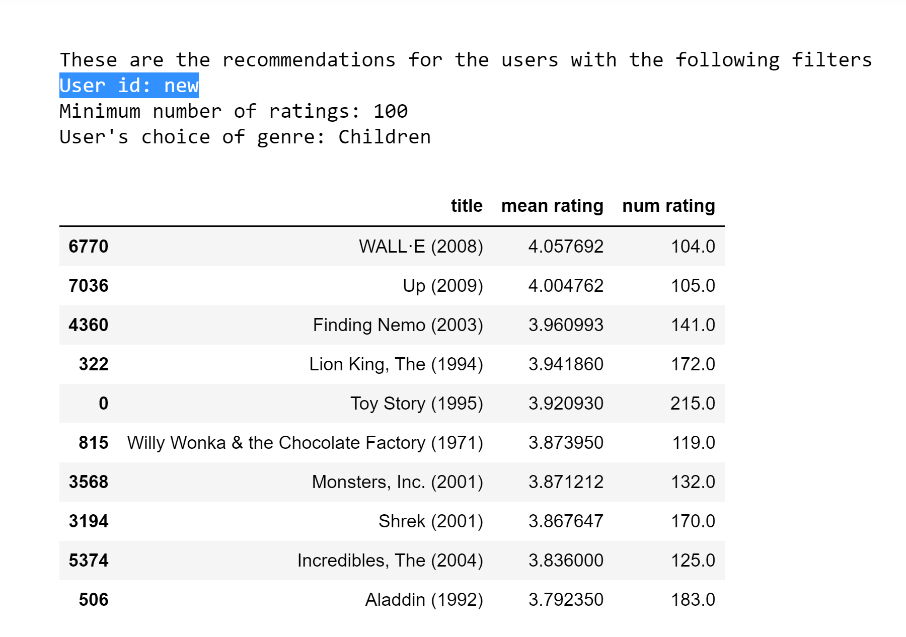
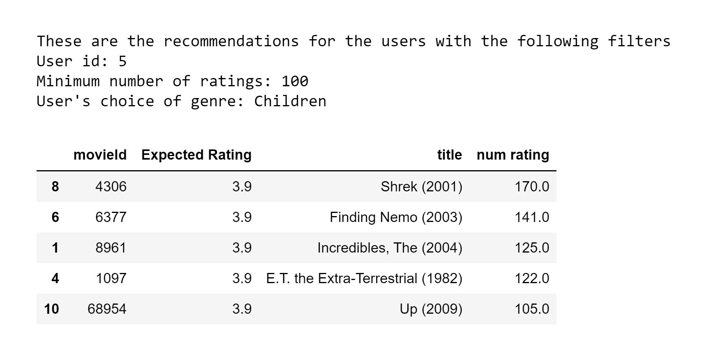

 # MovieLens Recomendation System

Author: Gamze Turan

 ## Overview

Movielens is a website that helps users find movies they will like. It users ratings given by the user to build a custom taste profile of that particular user and then utilizes that information to recommend other movies for the user to watch.

 ## Business Understanding

Our goal is to build a variety of recommendation engines and improve upon predictions iteratively so that the end user can be provided with better movie suggestions.

 ## Data Understanding

The datasets describe ratings and free-text tagging activities from [MovieLens](https://movielens.org/), a movie recommendation service.

**Source: F. Maxwell Harper and Joseph A. Konstan. 2015.The MovieLens Datasets: History and Context. ACM Transactions on Interactive Intelligent Systems (TiiS) 5, 4: 19:1–19:19. https://doi.org/10.1145/2827872

It contains 100836 ratings and 3683 tag applications across 9742 movies. These data were created by 610 users.

The dataset is distributed among four csv files: `links.csv`, `movies.csv`, `ratings.csv`, `tags.csv`.

 ## Data analysis

  

The mean rating given by users is approximately 3.5.
The most common rating in the dataset is 4.
Most of the ratings in the dataset are above 3.

 

Drama is the most popular genre in our dataset with 4357 movies, followed by Comedy with 3755 movies.

 

Movies that are more popular (higher number of ratings) in our dataset have higher mean ratings as well.

 ## Naive Recommendation Engine (New User)

Model recommends the most popular movies in our dataset to **new user**. Movies are sorted by both the number of ratings and their average rating in our dataset. 
I allow users to specify their preferred genre as well.

 

 ## Collaborative-Filtering based Recommendation Engine (Existing User)

Model recommends those movies that haven’t been watched by this user and were loved by other users with similar taste.

 ## Recommended Movies

When user is new, use naïve recommendation engine and only look at the most popular movies

When user has provided some ratings in the database, consider that information and try to find similar movies based on his/her taste. 

 ## Conclusion

I analyzed a variety of movie recommendation systems on the famous MovieLens database. I started with a naive recommendation engine which did not make any assumptions about the user and provided general recommendations based upon movie popularity or the average ratings given by other users in the database.

I then progressed to some collaborative filtering based engines which try to find similar movies or users to make their predictions. After assessing models on two metrics, RMSE and MAE, we designed a SVD model and also tuned it for multiple hyperparameters.

Finally, I made a hybrid system of our naive recommendation engine and the SVD model to help resolve the cold-start problem. We added filtering options for genre and minimum number of ratings to give users some control over these recommendations.

## Future Work

There is a lot of potential for future work in this project.

To begin with, I would like to add functionality in our final dashboard to allow new users to rate some movies and then to utilize that information to improve our recommendation system.

I also couldn't make use of tag information in this part of the analysis. We would like to make word embeddings from tags and other meta information about the movie and use it in our model.

I can also make use of the links dataset and scrape more information about each movie from the internet. This could involve significant features like cast, director, plot, etc.

## For More Information

See the full analysis in the Jupyter Notebook or review this presentation.

For additional info, contact Gamze Turan at ginaturan15@gmail.com

## Repository Structure 

├── Data

├── Deliverables

├── Images

├── MovieLens_Recommendation_System.ipynb

└── README.md